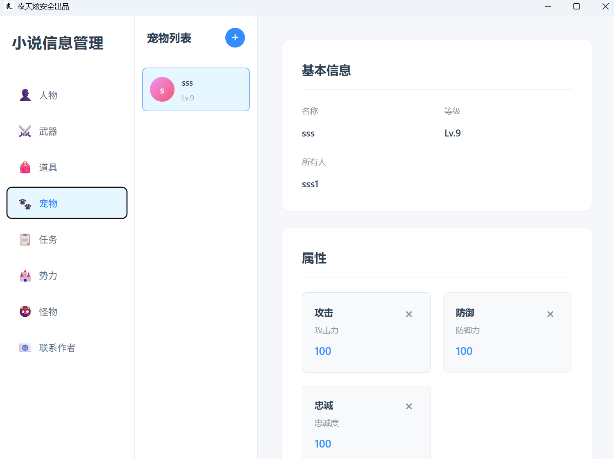
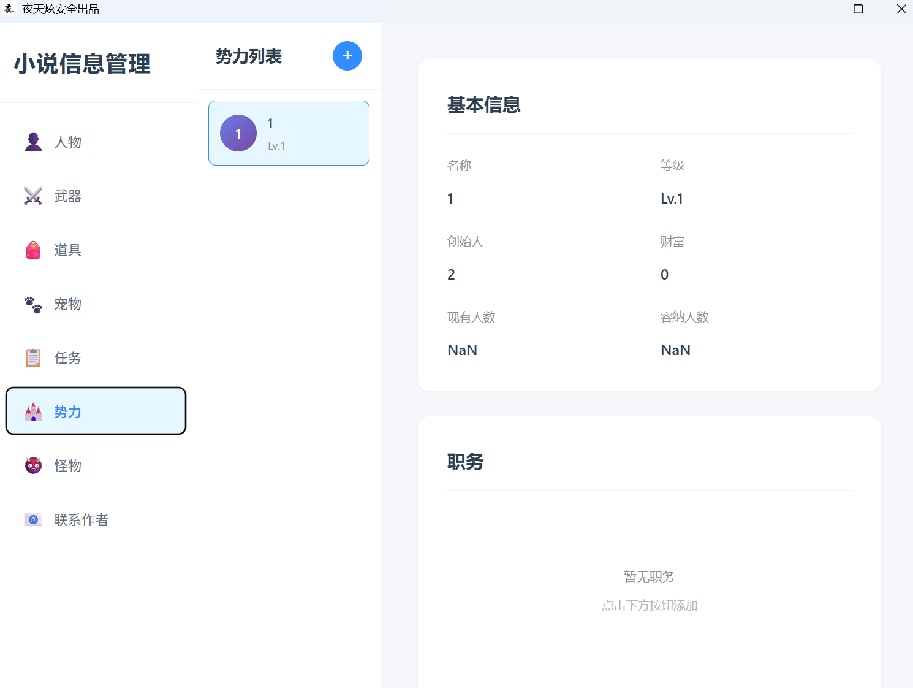
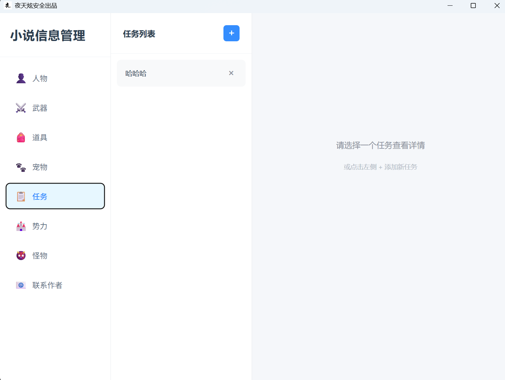
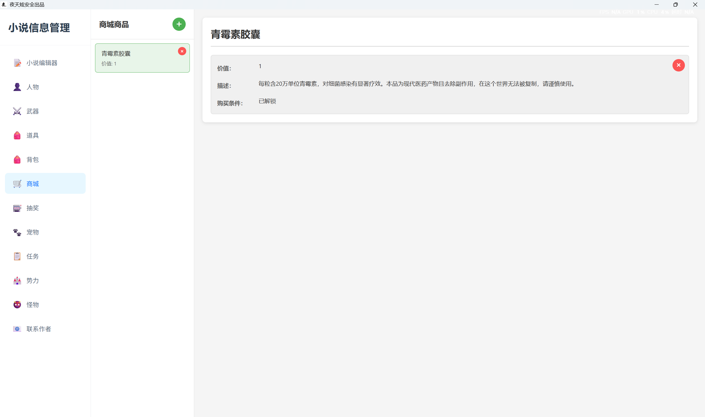
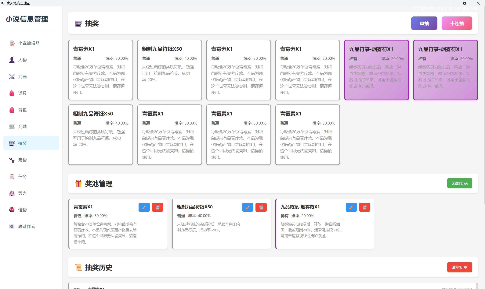

# NoolTools - 游戏管理工具

一款简约实用的网游小说数据管理工具，帮助您轻松管理游戏中的各种数据。


## 功能特性

### 📊 数据管理
- **人物管理** - 管理游戏角色信息、属性和技能
- **武器管理** - 管理武器数据、属性和技能
- **宠物管理** - 管理宠物信息、属性和技能
- **道具管理** - 管理游戏道具数据
- **怪物管理** - 管理怪物信息、属性和技能
- **势力管理** - 管理游戏势力、职务和属性
- **任务管理** - 管理游戏任务和任务详情
### 🎒 背包系统
- **背包管理** - 管理游戏背包，支持创建多个背包
- **物品管理** - 管理背包中的物品，支持添加、删除和编辑
- **物品信息** - 记录物品名称、数量和描述信息
- **背包详情** - 查看每个背包的详细物品清单

### 🛒 商城系统
- **商品管理** - 管理商城商品信息
- **商品属性** - 设置商品名称、价值、描述和购买条件
- **商品列表** - 查看所有商城商品
- **商品编辑** - 支持商品的添加、编辑和删除操作

### 🎲 抽奖系统
- **抽奖功能** - 支持基于爆率的随机抽奖
- **抽奖模式** - 支持单抽和十连抽两种模式
- **奖品管理** - 管理奖品信息、爆率和品种分类
- **抽奖历史** - 记录所有抽奖结果，支持查看和清空
- **实时显示** - 抽奖结果实时显示奖品名称和爆率

### ✨ 主要功能
- 直观的用户界面，操作简单易用
- 完整的增删改查功能
- 数据本地存储，安全可靠
- 响应式设计，适配不同屏幕尺寸


## 安装使用

### 安装
1. 从 [Releases](../../releases) 页面下载最新版本的 `nooltools.exe`
2. 将下载的文件保存到任意目录
3. 双击运行即可使用

### 使用说明
1. 启动程序后，左侧侧边栏显示所有功能模块
2. 点击对应的模块进入管理页面
3. 使用页面上的按钮进行数据的添加、编辑和删除操作
4. 所有数据会自动保存到本地sqlite数据库

## 界面预览

### 人物管理
- 查看所有人物列表
- 添加新人物（名称、类型、等级等）
- 编辑人物信息
- 管理人物属性和技能，均可自定义添加删除，均可修改


### 武器管理
- 查看所有武器列表
- 添加新武器（名称、类型、等级等）
- 编辑武器信息
- 管理武器属性和技能，均可自定义添加删除，均可修改


### 宠物管理
- 查看所有宠物列表
- 添加新宠物（名称、等级、属性等）
- 编辑宠物信息
- 管理宠物属性和技能，均可自定义添加删除，均可修改


### 道具管理
- 查看所有道具列表
- 添加新道具（名称、等级、功能等）
- 编辑道具信息，均可自定义添加删除，均可修改


### 怪物管理
- 查看所有怪物列表
- 添加新怪物（名称、类型、等级等）
- 编辑怪物信息
- 管理怪物属性和技能，均可自定义添加删除，均可修改


### 势力管理
- 查看所有势力列表
- 添加新势力（名称、等级、创始人等）
- 编辑势力基本信息
- 管理势力职务，均可自定义添加删除，均可修改
- 管理势力属性，均可自定义添加删除，均可修改


### 任务管理
- 查看所有任务列表
- 添加新任务（名称、类型、奖励等）
- 编辑任务信息，均可自定义添加删除，均可修改
- 管理任务详情，均可自定义添加删除，均可修改


### 文字编辑器
- 新增支持markdown的文字编辑器
- 支持markdown格式预览解析功能
- 新增目录浏功能，自动解析标题层级显示


### 背包系统
- 查看所有背包列表
- 创建新背包（名称）
- 编辑背包名称
- 删除背包
- 管理背包物品
  - 添加物品（名称、数量、描述）
  - 编辑物品信息
  - 删除物品
  - 查看背包详细物品清单


### 商城系统
- 查看所有商城商品列表
- 添加新商品（名称、价值、描述、购买条件）
- 编辑商品信息
- 删除商品
- 管理商品属性和购买条件


### 抽奖系统
- 查看所有奖品列表，支持按品种分类显示
- 添加新奖品（名称、品种、爆率、描述等）
- 编辑奖品信息
- 支持单抽和十连抽两种抽奖模式
- 基于爆率的随机抽奖算法
- 实时显示抽奖结果（奖品名称和爆率）
- 查看抽奖历史记录
- 支持清空抽奖历史
- 管理奖品品种，可自定义添加删除


## 数据存储

所有数据存储在本地数据库中，不可更改存储位置（也没多大），数据库文件位置：
```
C:\Users\[用户名]\.nooltools\nooltools.db
```

如需备份数据，请复制该数据库文件。

## 联系作者

如有问题或建议，欢迎联系：

- 📧 **邮箱**: heuxry@outlook.com
- 💬 **反馈**: 欢迎提出宝贵意见和建议
- ⭐ **支持我们**: 感谢您的使用和支持

关注微信公众号"夜天炫安全"获取最新动态和资讯。


## 更新日志
### v1.2.0 (2026-02-18)
- 🎉 新增背包系统功能
  - 支持创建多个背包
  - 背包物品管理，支持添加、编辑、删除物品
  - 物品信息记录（名称、数量、描述）
  - 背包详细物品清单查看
- 🎉 新增商城系统功能
  - 商城商品管理，支持添加、编辑、删除商品
  - 商品属性设置（名称、价值、描述、购买条件）
  - 商城商品列表展示
- 🎉 新增抽奖系统功能
  - 支持基于爆率的随机抽奖算法
  - 提供单抽和十连抽两种抽奖模式
  - 奖品管理功能，支持添加、编辑、删除奖品
  - 奖品品种分类管理，可自定义添加删除品种
  - 实时显示抽奖结果，展示奖品名称和爆率
  - 抽奖历史记录功能，支持查看和清空历史
  - 优化抽奖算法，确保随机性
  - 修复抽奖结果显示问题（显示名称而非爆率）
  - 修复爆率显示为NaN%的问题
  - 修复抽奖历史未正确更新的问题

### v1.1.0 (2026-02-17)
- 新增支持markdown的文字编辑器
- 支持markdown格式预览解析功能
- 新增目录浏功能，自动解析标题层级显示
- 优化界面显示

### v1.0.0 (2026-02-01)
- 初始版本发布
- 支持人物、武器、宠物、道具、怪物管理
- 支持势力管理（包含职务和属性）
- 支持任务管理
- 完整的增删改查功能
- 优化的用户界面

## 许可证

本项目仅供学习和个人使用，不提供任何商业支持。

## 免责声明

本工具仅用于辅助游戏数据管理，请勿用于任何非法用途。使用本工具所产生的一切后果由使用者自行承担。
